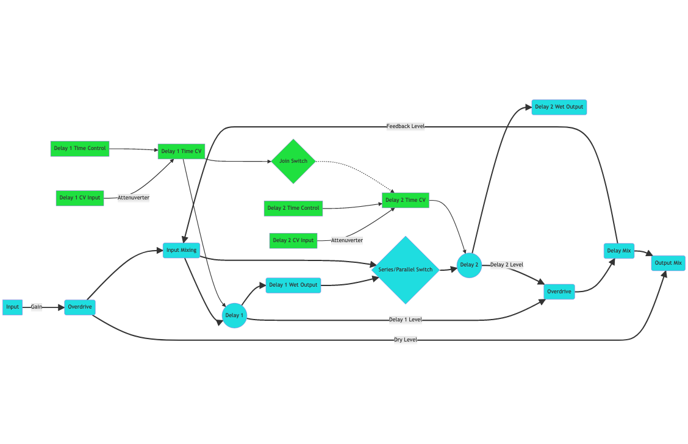

# Dual PT2399 Digi Delay

A delay module designed for the Loudest Warning 4U format

## Description

Built around two PT2399 delay chips.
Inspired equally by the Serge WAD and the Strega, it does clean pretty well but also pushes into the usual 2399 weirdness.

## Features

 * Dual PT2399 delays
 * Single input with gain control and mild overdrive when past about 1 o'clock
 * Switch to have delays in series or parallel
 * Delay can go from short as I think I could manage to well into clicks and squeals territory
 * CV control over delay time of each independently, with attenuverters
 * CV control has an input range of -5 to +5 volts, which should cover the full range of the delay either way
 * Join switch to have delay 1 CV/knob control affect delay 2 as well
 * Independent full wet outputs for each delay
 * Independent mix levels for each delay and dry into main mix out, with additional overdrive on the delays when pushed past about 1 o'clock
 * Feedback can very easily push into self oscillation territory

## Power

+12 101ma
-12 35ma

## Signal Flow

## Front Panel

In the [panel](./panel) folder there are Front Panel Design files that can be used to order aluminium panels. One has the oval holes that fit the Johnson banana plugs, whilst the other just has circular holes.

There are also gerber files for a PCB front panel if required.

The Affinity Design and Inkscape SVG files are included in the repository as well in case you want to redesign things.

## Part Information

Everything *should* be pretty clear and obvious as far as construction goes, but the following may be useful info.

### Capacitors

Caps noted as X7R are ones that are for power decoupling. Feel free to use C0G ones if you want.
Caps noted as polypropylene are used in the input and output filters of the PT2399 delay chip. Any decent film should be fine, but you can probably use C0G ceramics if you want.
Electrolytic caps noted as audio are ones that are in the audio path, so worth getting decent quality ones.

### Banana Jacks

Designed to work with the Johnson banana jacks, but others probably work.

### Power Connector

The PCB footprint for the power connector is for a Molex KK-254 connector. In reality I've assumed people with likely have a flying cable with whatever they use on the end.

## Construction Notes

The boards sandwich together with all components inside. This means that all the capacitors on the delay board need to be lying flat against the PCB.

Depending on what part you use for the Join switch, the lower leg from that may extend far enough to hit IC U5 on the mid board, so snip it off.

## Fixes

Some of the older revisions have some minor errors. Check the [Fixes](./fixes.md) file for more information.

## Availability

[Pusherman](https://pushermanproductions.com/product/4u-rumblesan-dual-pt2399-digital-delay-3-x-pcb-fr4-panel/)
Synthcube coming soon

## Contact

Drop me an email at guy@rumblesan.com

## License

This work is licensed under a [Creative Commons Attribution 4.0 International License]("http://creativecommons.org/licenses/by/4.0/")
